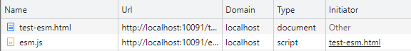
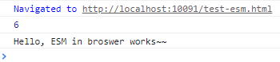

# ESM & MJS

`ESM`: **E**CMA**S**cript **M**odules

`MJS`: Com**m**on**JS** Module

## Usage in Broswser
When use ESM in browser:  
test-esm.html
```html
<!DOCTYPE html>
<html lang="en">
<head>
    <meta charset="UTF-8">
    <meta http-equiv="X-UA-Compatible" content="IE=edge">
    <meta name="viewport" content="width=device-width, initial-scale=1.0">
    <title>Test ESM</title>
    <script type="module" src="./esm.js"></script>
</head>
<body>
    <script type="module">
        import { add, sayHello } from './esm.js'
        console.log(add(2 ,4))
        console.log(sayHello())
    </script>
</body>
</html>
```
esm.js
```javascript
function add(a, b) {
    return a + b
}

function sayHello() {
    return "Hello, ESM in browser works~~"
}

export {
    add,
    sayHello
}
```
we can see:  

  

and it works in browsers:  
  

## Usage in node.js
summary:
+ .js resolve depends on `type` key in `package.json`, when `type='module'`, .js => .mjs; others `type='commonjs'`, .js => .cjs;
+ `ESM` and `MJS` can not use both in node.js, explicly distingush with `.mjs` and `.cjs`;
+ when you want to use .cjs in ESM feature, your can do this:
    ```javascript
    import packageMain from 'commonjs-package';
    const { method } = packageMain;
    ```
+ when you want to use .mjs in MJS feature, your can do this:
    ```javascript
    (async () => {
    await import('./my-app.mjs');
    })();
    ```
    sounds bad, right?

## node.js package.json config
```javascript
{
  ...
  "type": "module",
  ...
  "exports"：{ 
    "require": "./index.js"，
    "import": "./esm/wrapper.js" 
  }
}
```
when we `require()`, node.js will import from `./index.js`, and when we `import`, node.js will import from `./esm/wrapper.js`